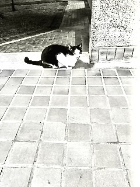
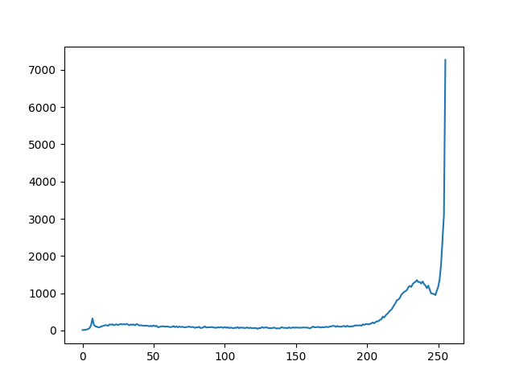
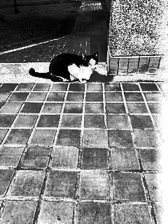
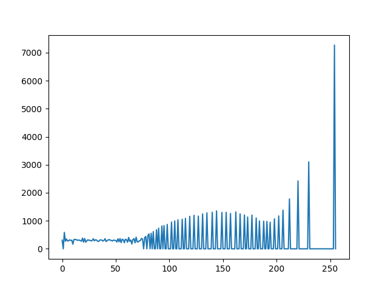
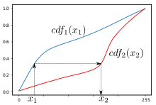

---

title: 實作！直方圖處理
slug: histogram
tags: [影像處理]
date: 2022-09-28
  
---
## 前言
本文會藉由Python以及openCV實作**直方圖等化**，以及介紹**直方圖匹配**。
那在開始之前，先來簡單介紹一下直方圖在影像裡面是啥意思！
直方圖統計影像中像素強度的分佈情形，這樣講好像很抽象，
其實就是把從0-255中的每一個值在圖片中的個數算出來畫成折線圖😅。
那直方圖處理就是藉由直方圖來增強影像的方法！

#### 要求
- 熟悉Python
- 愉快的心：）
#### 版本
- python： **3.8.13**
- openCV(非必要)：**4.6.0**
- Matplotlib(非必要)： **3.5.3**
- numpy：**1.23.2**

## 暖個身！
在開始正戲之前，先來暖暖手，簡單的畫個直方圖試試！為了方便以下圖片皆以經過黑白處理，但彩色圖片的處理方式沒有不同，只是要同時對三個通道(RGB)做同一個操作。先有請今天的model 宿舍貓貓：），為了讓效果更明顯圖片已經處理過讓他亮度呈現過亮。



```python
import cv2
import matplotlib.pyplot as plt
import numpy as np

class Histogram:
    def __init__(self, path: str) -> None:
        self.img = cv2.imread(path, 0)  # 以灰階方式讀取
        self.rows, self.cols = self.img.shape  # 行數及列數
        self.histogram=self.draw_histogram(self.img,"cat_hist")
    def draw_histogram(self, img: cv2.Mat,file_name:str) -> List[int]: 
        histogram = [0 for i in range(256)]  # 用來儲存0-255的像素個數
        for row in range(self.rows):
            for col in range(self.cols):
                pixel = img[row][col]
                histogram[pixel] += 1
        x_axis = [i for i in range(256)]  # 用來繪圖的x軸
        plt.clf()
        plt.plot(x_axis, histogram )
        plt.savefig(file_name)
        return histogram
        #用來畫下面例子的直方圖！
        # plt.plot(x_axis, histogram) 
        # plt.show()

        # 計算其實有cv2.calcHist()來計算直方圖
        # 但也沒很難就動手做做看ㄅ！
        
```


## 正題！直方圖等化
在了解直方圖是什麼後，就可以進入文章主軸了！直方圖等化的目標非常簡單，就是希望圖片的像素可以均衡分布，畫出來像一個長方形，當然不保證一定會是很均衡的，像是給一張黑色的圖片我們怎麼操作當然還是希望他仍是全黑的，不然就不像原圖了!那我們如何同時均衡直方圖也盡量讓圖片看起來很像呢？我們可以統計每一種像素值的累積百分比，然後使用強度$\times $百分比來換算新的對應強度，直接看式子可能更有感！
$h(v)=255\times$ (當前像素累積百分比$-$最低累積百分比)
$v$是原數值，$h(v)$是經直方圖等化後對應的像素值

上式中不確定的可能是為什麼後面要減那一項，因為我們希望可以將最黑的那個像素(最低累積百分比的那個像素)映射到黑色去，藉由減掉那個值，我們可以保證最黑的那個像素會是黑色的($255 \times 0=0$)

直接上扣！
```python

def histogram_equalization(self) -> None:
    total_pixels = self.rows * self.cols  # 總像素數=行數*列數
    min_accumulate = -1  # 最低累積
    cur_pixel=0 #累積pixel
    transfer_table = [i for i in range(256)]  # 紀錄轉換後的值

    for i in range(len(self.histogram)):#計算轉換值 

        if self.histogram[i] and min_accumulate == -1:  # 還沒遇過像素
            min_accumulate = self.histogram[i]
        cur_pixel += self.histogram[i]
        transfer_table[i] = int((cur_pixel-min_accumulate)/total_pixels * 255)
    
    self.equalize_image= np.zeros((self.rows,self.cols),dtype=np.uint8)

    for row in range(self.rows):#依照轉換值得到新圖片
        for col in range(self.cols):
            self.equalize_image[row][col]= transfer_table[self.img[row][col]]

    cv2.imwrite("equalize_cat.png",self.equalize_image)
    self.equalize_histogram= self.draw_histogram(self.equalize_image,"cat_equalize_hist")

```


| 等化前 | 等化後|
|  :---:   |  :---: |
|    ||




只是看了等化後的直方圖會發現，說好的像長方形？因為像素值要是整數，我們使用百分比$\times$強度再取**int( )** 會有多個像素對應到同一個像素去，導致轉換後某些像素個數為0。

## 直方圖匹配
在學完直方圖匹配後，就可以來學更進階的直方圖匹配了！直方圖匹配的概念是給定一個任意直方圖，能否將原圖片的直方圖盡量接近他。那講到這邊或許你就會發現，直方圖等化就是直方圖匹配的特例，在直方圖等化中我們給定的直方圖就是一個所有像素平均分佈的長方形！用長方形想很好想，但如果是任意的直方圖該怎麼做呢？

先想想我們在直方圖等化中做的事情，用像素值的累積百分比換算出新的值，本質上就是在計算當前像素$v$的累積百分比後，尋找另一個像素值$v^{'}$使得$v^{'}$在給定的直方圖中的累積百分比=當前像素值在原圖的累積百分比。

概念就像下圖( 來自wiki )，將$x1$映射到$x2$因為他們的累積百分比相同，那如果是直方圖等化，紅色的曲線就會是一條斜直線，對應過去的值就會是$255 \times$ 累積百分比！



## end 
這篇文章大概就到這邊ㄌ：（，礙於時間因素沒有補上直方圖匹配的扣。

未來有空再回來補！
或是有看到其他直方圖處理方法再回來更新！
#### 相關資源 & ref
- Gonzalez woods - Digital Image Processing 
- Wiki - Histogram matching